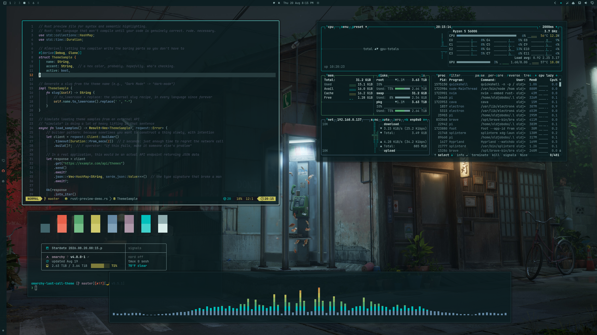

# Omarchy Last Call Theme

A rain-lit, late-night Omarchy theme inspired by Daniil Alekseev’s *Last Call*. Smoked blue-green surfaces keep the desktop calm; fluorescent cyan, vivid brass, living green, and a single red signal make every important state easy to read.

## Preview



## Install

Install directly with Omarchy:

```bash
omarchy-theme-install https://github.com/OldJobobo/omarchy-last-call-theme
```

Select **Last Call** from the Omarchy theme menu after installation.

## The Experience

- **A quiet working canvas** — deep rain-glass backgrounds reduce glare without crushing detail.
- **Signals with meaning** — cyan marks focus, yellow marks waiting and unread activity, green confirms positive state, and red is reserved for urgency.
- **Minimal geometry** — narrow borders and restrained rounding keep the desktop precise rather than soft or bubbly.
- **Wallpaper-aware depth** — translucent terminals, focused blur, and dark shadows preserve the street scene without sacrificing text clarity.
- **One visual language** — the shell, terminals, editors, system tools, and Discord all follow the same palette and state hierarchy.

## What’s Included

- Omarchy 4 shell styling and Hyprland presentation
- Compatibility styling for Omarchy 3.8
- Alacritty, Foot, Ghostty, and Kitty themes
- Zed, VS Code, and Neovim/Aether editor treatments
- btop, GTK, Chromium, and Zellij integration
- A custom Midnight-based Vencord theme
- A complete 24-color Base24 scheme
- Eleven coordinated wallpapers

## Vencord

Discord receives a full Last Call treatment rather than a simple palette swap:

- smoked-glass panels and a separated message composer
- a custom payphone home icon
- compact `4px` rounding that visually matches the desktop
- vivid yellow unread channels and markers
- cyan focus, selection, links, and active borders
- red mention and urgent-state signaling
- coordinated presence colors, code blocks, scrollbars, and muted text

Load [`vencord.theme.css`](vencord.theme.css) through Vencord’s **Themes** settings or your existing theme-hook workflow. It uses [Midnight](https://github.com/refact0r/midnight-discord) as its layout foundation and imports that stylesheet remotely.

## Base24 Palette

The included [`last-call-base24.yaml`](last-call-base24.yaml) provides 24 individually authored colors with no placeholder slot duplication. It can be used independently anywhere Base24 schemes are supported.

| Role | Color | Purpose |
| --- | --- | --- |
| Canvas | `#0B1D20` | Main background |
| Cyan | `#00C6C2` | Focus and connection |
| Yellow | `#C5C15A` | Waiting and unread activity |
| Green | `#58AD73` | Success and positive state |
| Red | `#ED634C` | Errors and urgent attention |
| Foreground | `#94B3B5` | Primary text |

## Wallpapers

<table>
  <tr>
    <td></td>
    <td></td>
    <td></td>
  </tr>
  <tr>
    <td></td>
    <td></td>
    <td></td>
  </tr>
  <tr>
    <td></td>
    <td></td>
    <td></td>
  </tr>
  <tr>
    <td></td>
    <td></td>
  </tr>
</table>

## Compatibility

- Built for Omarchy 4, with the corresponding Hyprland presentation retained for Omarchy 3.8.
- Vencord is optional and must be enabled separately through Vencord or a theme-hook integration.
- `Yaru-yellow` is selected as the matching icon theme.

## Attribution

- Wallpaper artwork: [Daniil Alekseev — *Last Call*](https://www.linkedin.com/posts/daniil-alekseev-182a09219_hey-everyone-im-happy-to-finally-share-activity-7490753531084341248-FVDg)
- Vencord layout foundation: [Midnight by refact0r](https://github.com/refact0r/midnight-discord)
