# Omarchy Last Call Theme

A rain-cold Omarchy theme drawn from Daniil Alekseev’s *Last Call*: smoked blue-green glass, weathered storefronts, fluorescent cyan, and a warm signal still burning after closing time.

## Preview

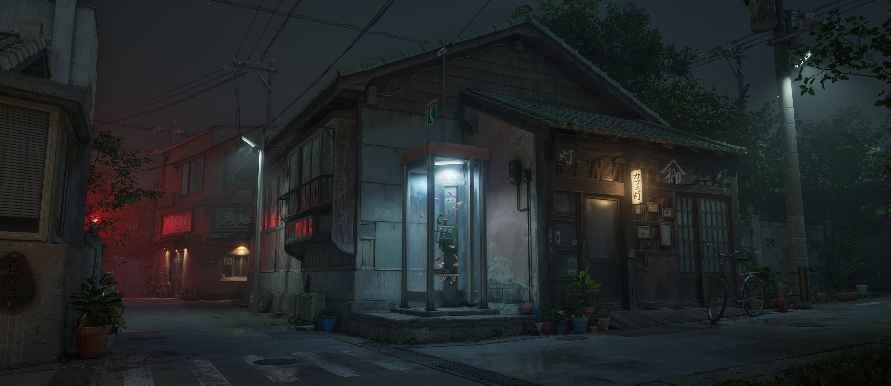

### Cold Line / Warm Signal

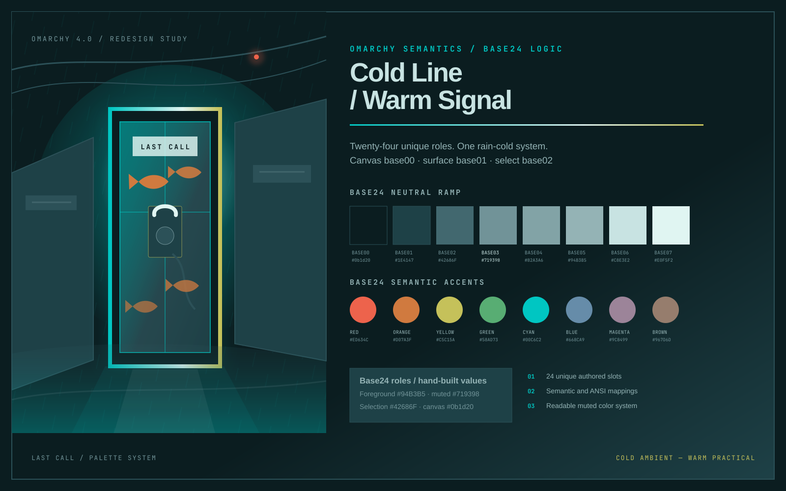

## Install

Use the Omarchy theme installer:

```bash
omarchy-theme-install https://github.com/OldJobobo/omarchy-last-call-theme
```

## What’s Included

- A hand-authored, 24-color Base24 scheme with unique `base00`–`base17` values.
- Native Omarchy 4 shell and Hyprland presentation, plus an Omarchy 3.8 Hyprland compatibility mirror.
- Coordinated terminal themes with `0.85` native background opacity for Alacritty, Foot, Ghostty, and Kitty.
- A custom Midnight-based Vencord theme with a payphone DM icon, separated composer, minimal `4px` rounding, and deliberate channel-state colors: yellow unread, cyan focus, and red urgency.
- Matching Zed, VS Code, Neovim/Aether, btop, GTK, and Zellij treatments.
- Eleven wallpapers from Daniil Alekseev’s *Last Call* and phone-booth studies.

## Palette Model

[`last-call-base24.yaml`](last-call-base24.yaml) is the canonical scheme. Its neutral ramp moves from rain-black glass through oxidized teal and into cold fluorescent text. Cyan owns connection and focus; vivid brass and green carry waiting and positive state; signal red is reserved for errors, direct attention, and urgent controls.

[`colors.toml`](colors.toml) is the Omarchy runtime projection. Its semantic roles and conventional ANSI normal/bright pairs map directly back to the Base24 source without placeholder slot duplication.

## Vencord

[`vencord.theme.css`](vencord.theme.css) imports [Midnight](https://github.com/refact0r/midnight-discord) and then applies the Last Call palette and interface treatment. It includes:

- smoked-glass opaque panels and a separated message composer
- compact industrial geometry tuned to resemble Hyprland’s minimal window rounding
- vibrant yellow unread channel names and markers
- cyan selection, focus, links, and active borders
- red mention and urgent-state signaling
- readable muted text, code blocks, status colors, and scrollbars

The file is an optional app integration; it must be loaded by Vencord or by the theme-hook setup managing your Vencord themes. The Midnight stylesheet is imported remotely.

## Wallpapers

<table>
  <tr>
    <td></td>
    <td>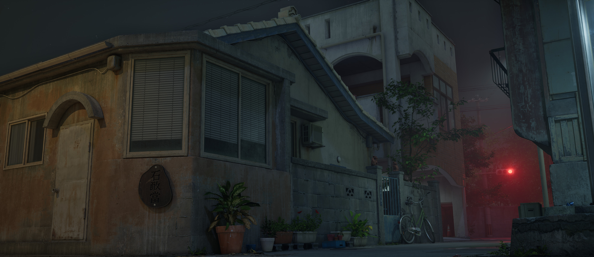</td>
    <td>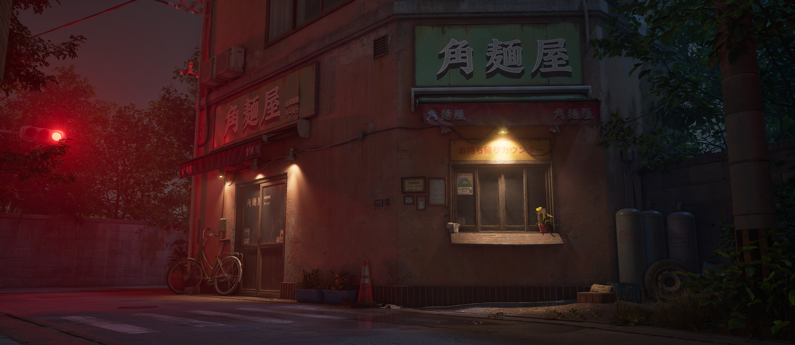</td>
  </tr>
  <tr>
    <td>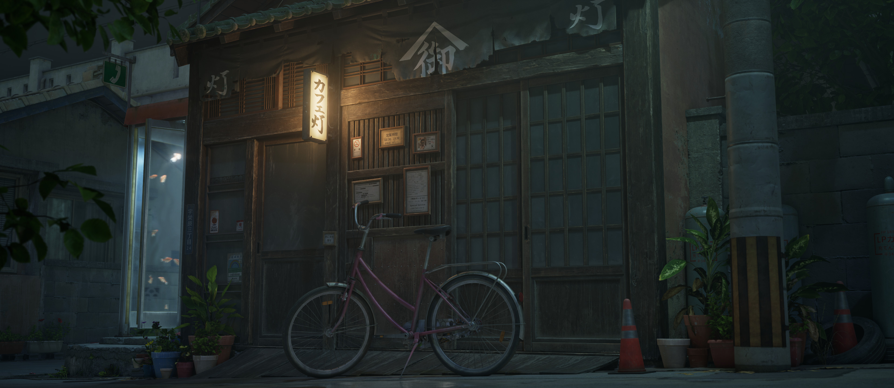</td>
    <td>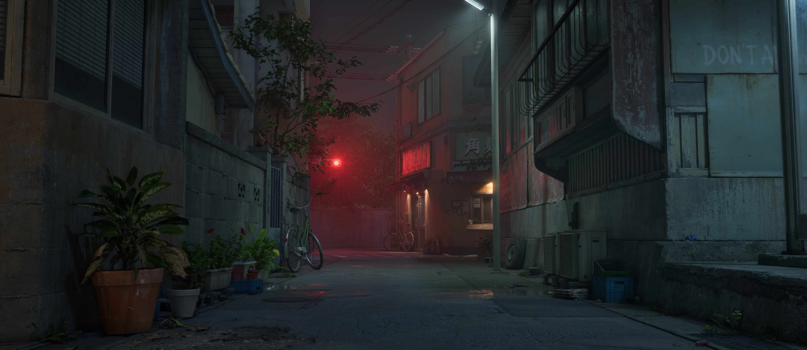</td>
    <td>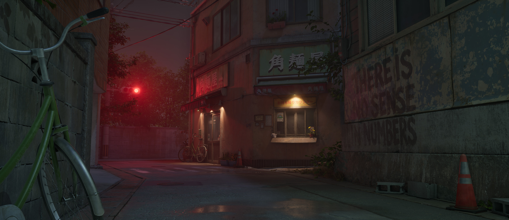</td>
  </tr>
  <tr>
    <td>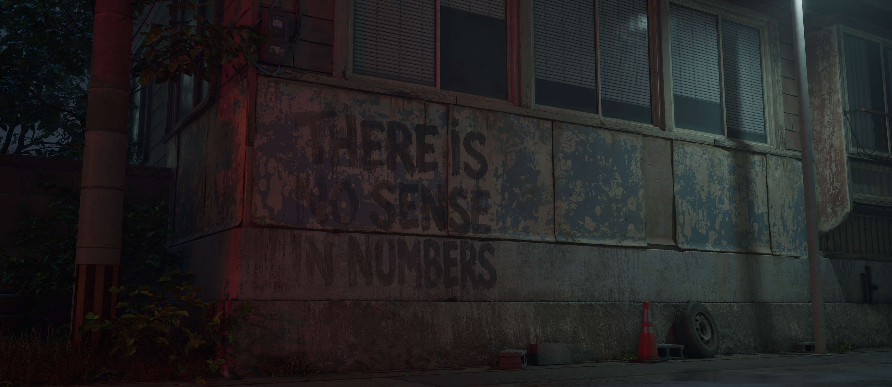</td>
    <td>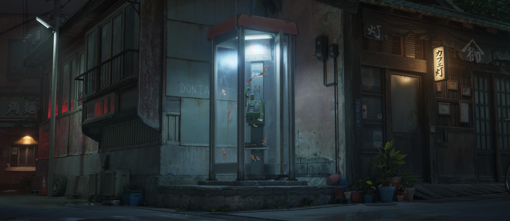</td>
    <td>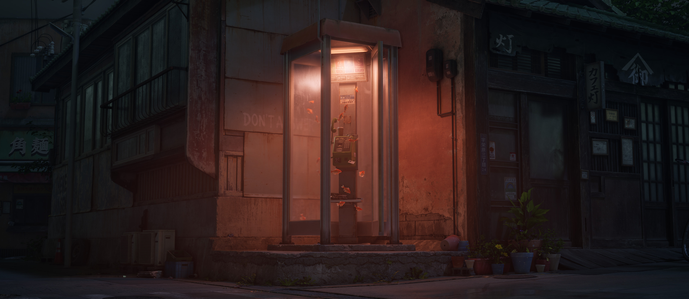</td>
  </tr>
  <tr>
    <td>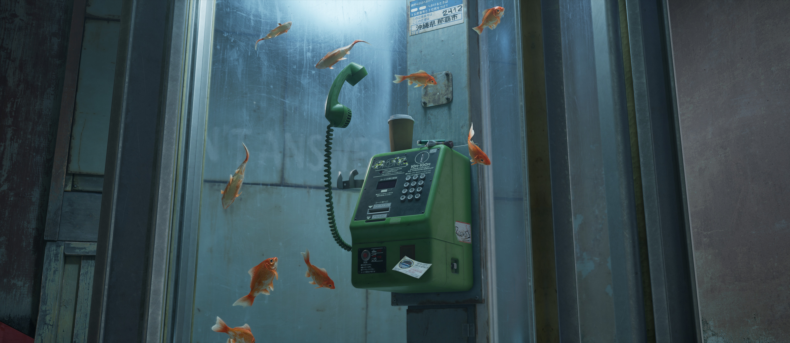</td>
    <td>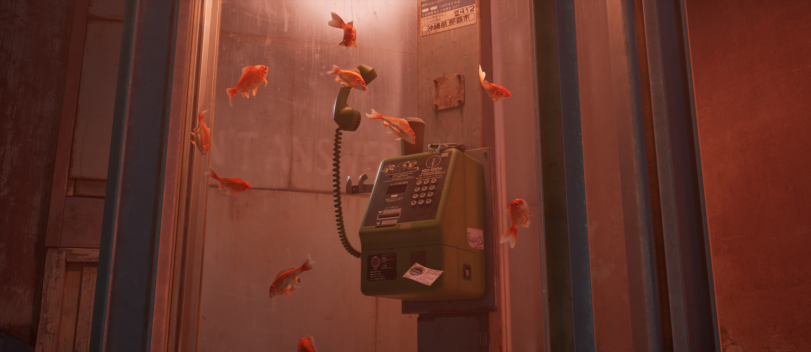</td>
  </tr>
</table>

## Notes

- Omarchy 4 uses `shell.toml` and `hyprland.lua`; `hyprland.conf` preserves the corresponding 3.8 presentation.
- The bundled Aether identifiers used by Neovim are functional integration names, not the theme’s display name.
- `Yaru-yellow` is the configured icon theme.

## Attribution

- Wallpaper artwork: [Daniil Alekseev — *Last Call*](https://www.linkedin.com/posts/daniil-alekseev-182a09219_hey-everyone-im-happy-to-finally-share-activity-7490753531084341248-FVDg)
- Discord base stylesheet: [Midnight by refact0r](https://github.com/refact0r/midnight-discord)
